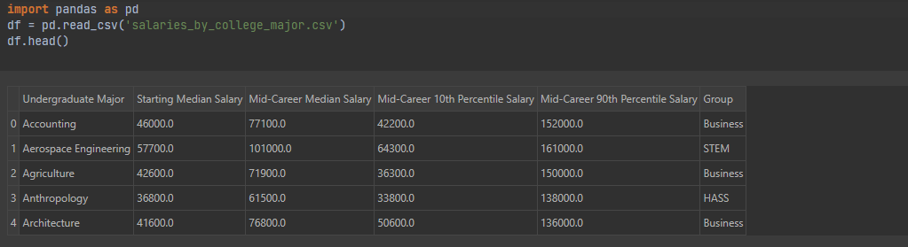
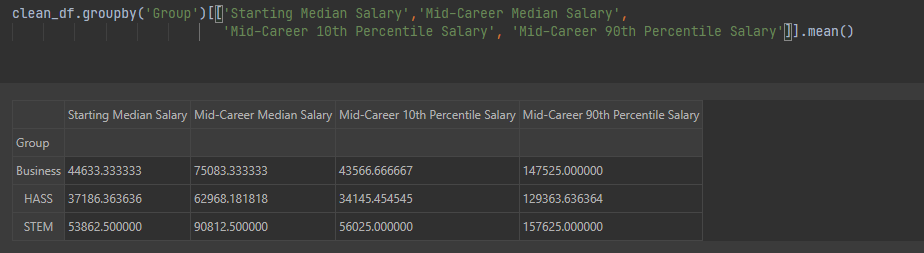
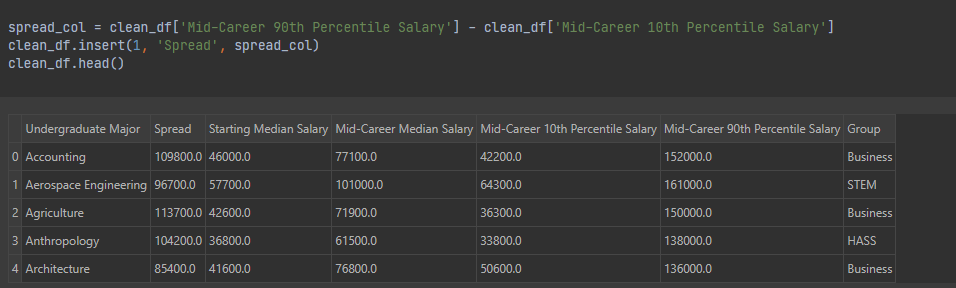

# DataAnalys_CollegeMajor
> Data Exploration with Pandas by Analysing the Post-University Salaries of Graduates by Major.

## Table of contents
* [General info](#general-info)
* [Screenshots](#screenshots)
* [Technologies](#technologies)
* [Setup](#setup)
* [Status](#status)

## General info
It is one of the Data Analysing projects which is suppoused to hone my skills in that category.

Main goals of the project were:
* Explore Pandas DataFrame.
* Detect NaN values and clean given data.
* Select Particular columns, rows and idividual cells.
* Sort data.
* Group data by category.

As a notebook I used Datalore from Jetbrains.

It's one of the projects from [Angela's Python Bootcamp](https://www.udemy.com/course/100-days-of-code/)

## Screenshots

## Technologies
* Python 3.8
* Pandas 1.3.3

## Setup
Import notebook and data from csv file into one of the Data Science Notebooks (f.e. Datalore).

## Status
Project is: _finished_.
